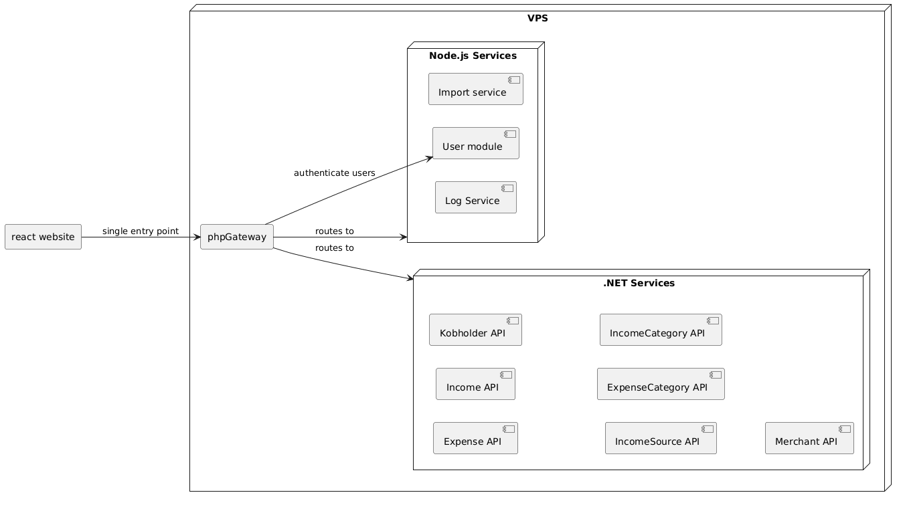
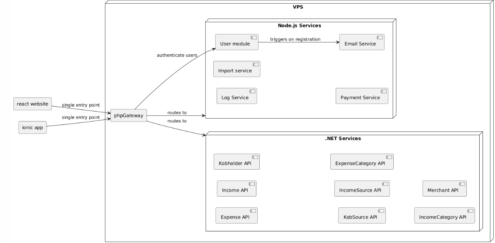

# Components

This page shows how the services that make up Kobflow are structured, 
how requests are routed, and how services depend on data.

## Current State

- **.NET Services** — the core domain APIs (Expense, Income, Kobholder, 
  KobSource, IncomeSource, ExpenseCategory, IncomeCategory, Merchant). 
  All run as independent C# services on the VPS.
- **Node.js Services** — Log Service, User module, Import service, 
  Email Service, Payment Service. Independent services on the VPS.
- **phpGateway** — currently handles authentication and grants access 
  to the .NET services.
- **react website** — the frontend web client.

### Known transitional state

- The react website still calls .NET services **directly** in some 
  cases, alongside going through `phpGateway`. This is not the intended 
  end state.
- `phpGateway` currently handles authentication itself, rather than 
  delegating to `userModule`.
- The Ionic mobile app does not exist yet — it's part of the goal state 
  only (see below).

## Goal: Routing & Auth
 

The target is for `phpGateway` to become the **single entry point** — 
neither the react website nor the Ionic mobile app call `.NET Services` 
or `Node.js Services` directly. `phpGateway` also delegates 
authentication to `userModule` instead of handling it itself.

This adds a second client to the picture: an **Ionic app** for mobile, 
alongside the existing react website. Both route through `phpGateway` 
the same way.

This diagram covers routing and auth only. Data dependencies (which 
service talks to which database) are intentionally left out — see 
below.

## Source

Diagrams are written in PlantUML.

- [`components_current.puml`](./components_current.puml) — current state
- [`routing-and-auth.puml`](./routing-and-auth.puml) — goal state (routing/auth)

Update the `.puml` files and re-render the images when the architecture 
changes.